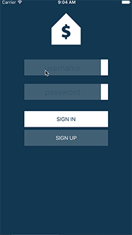

# Prototyping with Xcode and Swift @ ITP Camp 2016
All supplementary workshop materials and links can be found here: [Presentation Slides](https://docs.google.com/presentation/d/1A8NHtQEestswjv4FRpV_piCyJeJwtOuuwQ6hZ4cNaSs/edit?usp=sharing)

## PREREQUISITES
### MUST HAVES
* Have a computer running OSX/macOS 
* Have Xcode (between 7.1 - 7.3)
* Have an Apple Developer account - [how to set it up](http://www.idownloadblog.com/2015/12/24/how-to-create-a-free-apple-developer-account-xcode/)
* Sketch, [download here](https://www.sketchapp.com/)
* Sketch Toolbox, [download here](http://sketchtoolbox.com/)
* Install the Aeiconizer plugin
* PaintCode, [download here](https://www.paintcodeapp.com/)

## PLAN
* Storyboard an app from images, they will be provided for you if you don't have any
* Prototype an app you’ve designed, if you don’t have a prototype, one will be provided for you
* Drawing in Code
* Advanced prototyping - adding some code!

## STORYBOARDING FROM IMAGES
* The first app we'll be making is a clone of a popular image sharing app, Impostergram

<!---->

## SIMPLE PROTOTYPING
* Prototyping with UI Elements - rectangles, text, images...

<!---->

## DRAWING WITH CODE
* Learn how to use PaintCode and use it in your Xcode projects

<!---->

## ADVANCED PROTOTYPING WITH CODE
* How to add some coding magic to your prototypes